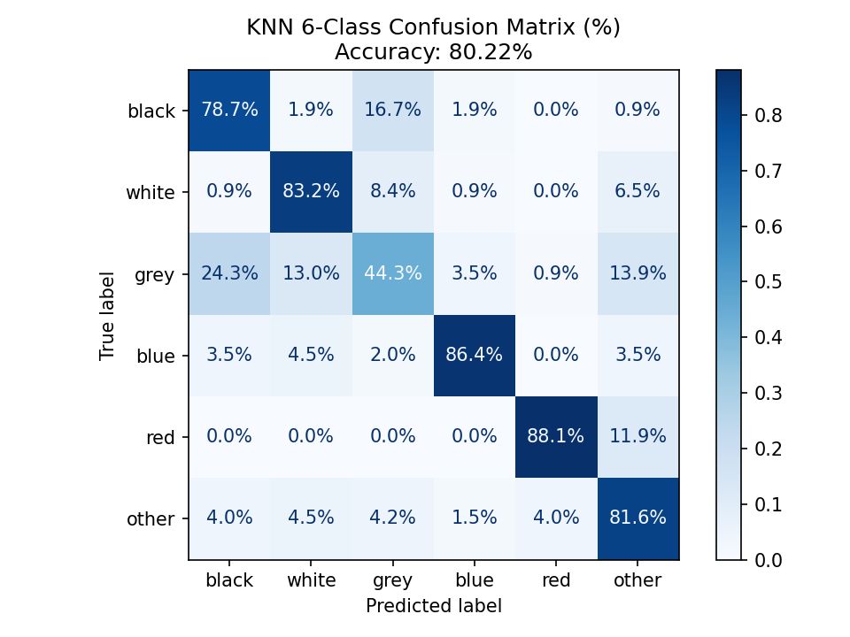
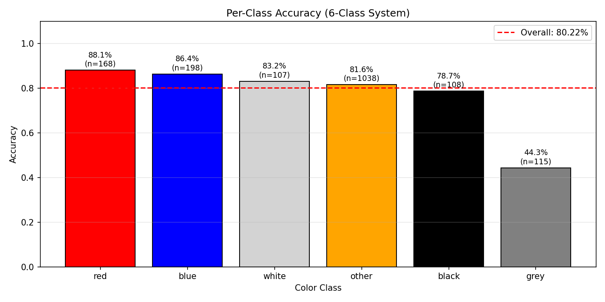
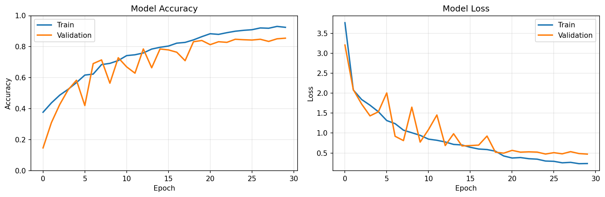
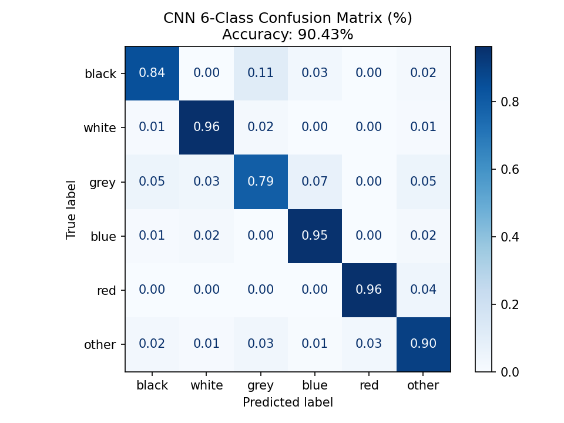
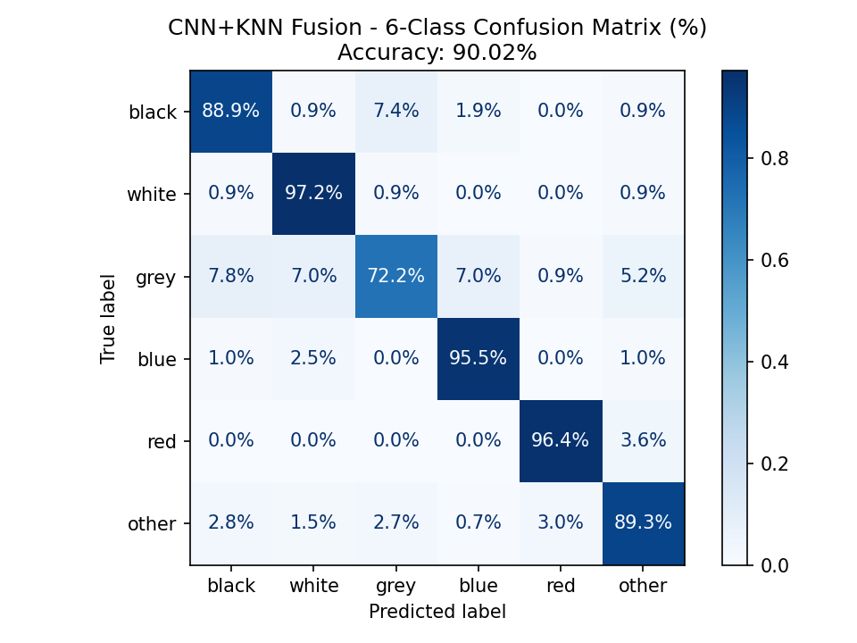

# HybridColourNet - Vehicle Detection and Colour Classification

A fun project exploring vehicle detection and colour classification using a hybrid CNN+KNN approach.

Project Overview
-

HybridColourNet is a computer vision system I developed to better understand how different machine learning techniques can be combined for real-world applications. The project focuses on detecting vehicles and accurately classifying their colours using a fusion of YOLO-based detection with CNN and KNN classification.

Core Components
-

**1. Vehicle Detection: LEAF-YOLO (pre-trained)**

LEAF-YOLO is a recent and efficient object detection algorithm specifically designed for challenges like detecting small objects in complex aerial imagery captured by drones.

Reasons for using LEAF-YOLO:
- Lightweight: Small model size for high efficiency.
- Proven Accuracy: Demonstrated superior performance on the VisDrone benchmark.
- Real-Time Capable: Designed for fast inference on edge devices.
- Modern Architecture: A recent (2025) advancement over older YOLO variants.

Although I did train the model separately, I ultimately chose to use the pretrained model provided by the authors due to its results being more robust, especially in crowded settings.

**2. Colour Classification Model**

**KNN:** The K-Nearest Neighbours (KNN) model is used as a lightweight, fast, and interpretable baseline for vehicle colour classification.
It classifies each vehicle by comparing its mean Lab colour (a 3-value feature) with the closest samples in the training set.
However, it struggles with:
- "grey" as it overlaps with black and white in brightness, causing those colours to blend together in Lab space.




**CNN:** This is a small, custom-built neural network trained end-to-end on the dataset.
A CNN can learn deep visual patterns such as shading, texture, lighting conditions, and localized colour cues. 
It works better than KNN overall, but CNN struggles with:
- Grey vs. Black/White: These colours share overlapping brightness values, causing confusion.
- Far-distance vehicles: Small crops mean fewer pixels → CNN loses detail and becomes less confident.
- 




**CNN+KNN Fusion:** The goal is to combine the strengths of the two very different colour classification models to reduce their weaknesses. 

I evaluated the two methods in different situations (blurred, lowlight, noisy) in attempt to represent the crops that would come from LEAF-YOLO's detections. After comparing the two methods, it was clear that although CNN performed better overall, KNN performs better on blurry, noisy images. 
Therefore, I drew the following conclusions: 
- CNN is highly accurate when the object is large and clear. 
- KNN is more stable when vehicles are small, far way or blurry, because it relies only on simple colour statistics.


The final decision was to use the KNN and CNN together.

**How it works:**

1. The CNN predicts a colour and provides a confidence score.
2. The KNN predicts a colour based on similarity in Lab colour space.
3. The fusion rule then selects the final colour using:
- High CNN confidence → trust CNN
- Low CNN confidence → trust KNN
- If both agree → accept the shared answer
4. Special handling for grey (trust KNN for distant low-detail cars, and trust CNN when distinguishing black/white up close)




**3. Dataset**

This project is based on the **VCOR – Vehicle Colour Recognition Dataset** from Kaggle. I adapted the original dataset for a 6-class vehicle colour task ```black``` ```white``` ```grey``` ```blue``` ```red``` ```other```, as well as the following additional changes:
- class balancing: evening out the number of samples per colour class
- simple data augmentation with the options below (doubled the dataset):
  - Horizontal flip
  - Gaussian blur
  - Random corner crop

Installation and Setup
-

1. Create and activate conda environment.

```
conda create -n hybridcolournet python=3.9
conda activate hybridcolournet
```

2. Clone repo
   
```
git clone https://github.com/franmonique/HybridColourNet.git
```

3. Clone LEAF-YOLO repo **inside** project.
   
```
cd HybridColourNet
```

Follow the link below and clone their repo INSIDE the HybridColourNet project. 
https://github.com/highquanglity/LEAF-YOLO

4. Install requirements

```
pip install -r requirements.txt
```

Dataset Requirements
-

In order to use your own dataset, it must follow the structure outlined below:

```
dataset/
├── train/
│   ├── black/
│   ├── white/
│   ├── grey/
│   ├── blue/
│   ├── red/
│   └── ...
└── test/
    ├── black/
    ├── white/
    ├── grey/
    ├── blue/
    ├── red/
    └── ...
```

You are free to train on any other colours, but your dataset must include the 5 core colours as shown above.

Training/Testing CNN
-

1. Train CNN

```
python scripts/train_vehicle_color.py --train-dir "path/to/dataset/train"
```
2. Test CNN

```
python scripts/test_vehicle_color.py --test-dir "path/to/dataset/test"
```

Building/Testing KNN
- 

1. Build KNN dataset

```
python scripts/build_color_knn_dataset.py --train-dir "path/to/dataset/train"
```

2. Test KNN:

```
python scripts/test_knn.py --test-dir "path/to/dataset/test"
```

Testing KNN+CNN
-

```
python scripts/test_cnn_knn.py --test-dir "path/to/dataset/test"
```

Inference
-
The script uses the following default configuration. See the table below for default values. 

| Argument | Default Value |
| :--- | :--- |
| `--source` | `inference/images` |
| `--weights` | `cfg/LEAF-YOLO/leaf-sizes/weights/best.pt` |
| `--color-model` | `results/cnn/vehicle_color_best.h5` |
| `--knn-data` | `None` |
| `--color` | `all` |
| `--img-size` | `640` |
| `--conf-thres` | `0.25` |
| `--iou-thres` | `0.45` |
| `--device` | `""` |
| `--project` | `results/cnn_knn/car_finder` |
| `--name` | `exp` |

1. For an image (default):
   
```
python scripts/car_finder_cnn_knn.py --source "image.jpg"
```

2. For a video (default + colour specification eg.):

```
python scripts/car_finder_cnn_knn.py --source "video.mp4" --color "red"
```

3. For Custom Configuration:

```
python scripts/car_finder_cnn_knn.py \
    --source <path_to_input_image_video_or_folder> \
    --weights <path_to_yolo_weights_file.pt> \
    --color-model <path_to_cnn_model_file.h5> \
    --knn-data <path_to_knn_data_file.npz> \
    --color <target_color_or_'all'>
```

Or single command:

```
python scripts/car_finder_cnn_knn.py --source <path_to_input> --weights <path_to_weights.pt> --color-model <path_to_cnn.h5> --knn-data <path_to_knn.npz> --color <target_color>
```

**Inference Example Below**


Image from: https://www.vecteezy.com/photo/18761489-mexico-city-mexico-february-3-2019-mexican-metropolis-capital-congested-traffic

Future Work/Improvements
- 

From results and observation, here are some of the key areas that still need work in this project:

**Better-suited datasets**: While the CNN achieved high accuracy on the dataset, this did not always translate well during inference, especially for small or distant vehicles. This highlights the need for datasets that better match real-world conditions and also explains why KNN was kept as part of the final system.

**Smarter cropping from detections**: In crowded scenes, bounding boxes can include parts of other vehicles or the background. Improving how crops are generated could help reduce this and lead to cleaner colour inputs.

**Video tracking support**: Adding tracking for videos could be a great help with providing stable colour predictions and making the results more visually pleasing and fun to watch. It would also increase the application capabilities. 

**Handling tricky colours and reflections**: Colours like grey, silver, and white are still difficult, especially with strong reflections or changing lighting. Exploring better pre-processing or using temporal information could help reduce these errors.

Reflection
-
Overall, this was a light, fun project and a great learning experience. It helped me better understand how different models behave in practice, especially when dealing with real-world issues like blur, noise, and lighting changes. There’s definitely plenty of room for improvement, and it’s a project I’d be excited to revisit in the future to refine and push further.

Acknowledgements
- 

**LEAF-YOLO**

Thanks to the authors and researchers of LEAF-YOLO for their impressive work and for openly sharing their implementation, which was used for the vehicle detection component of this project.
https://github.com/highquanglity/LEAF-YOLO

**VCoR Vehicle Colour Recognition Dataset (Kaggle)**

Thanks to Landry Kezebou for providing the VCoR vehicle colour dataset, which was used for training and evaluating the vehicle color classification models.
https://www.kaggle.com/datasets/landrykezebou/vcor-vehicle-color-recognition-dataset

**VisDrone 2019 Detection Dataset**

Thanks to the VisDrone team for releasing a large-scale, well-annotated dataset that supports research in vehicle detection and aerial imagery analysis.
https://datasetninja.com/vis-drone-2019-det
